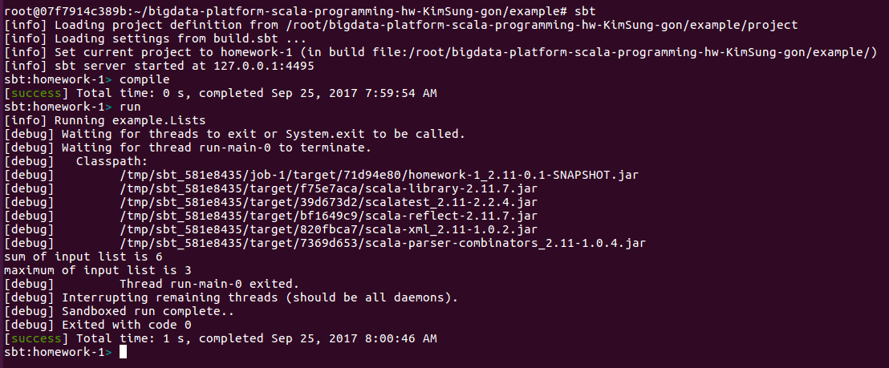

# bigdata-2017-02-homework-1
In this homework, you are going to have an experience on using sbt to compile, run, and test Scala source codes.
To complete the homework, you should do the followings
The homework should be submitted through this README.md file. In case you are not familar with using the md file, please reference the md file cheat sheet. [sample cheat sheet](https://github.com/adam-p/markdown-here/wiki/Markdown-Cheatsheet)

1. Run `sbt` under the example folder and type `compile`. You should capture the screen to indicate the completion of compile and add the captured screenshot below. **You should replace the image below**


2. Open `src/main/scala/example/Lists.scala` file and implement `sum` and `max` methods. You should implement it using a recursive function. Do not use any loop command, such as for, while, ...


3. On the `sbt` screen, type `run`. It will print out an message `java.lang.RuntimeException: No main class detected.` . Open, `src/main/scala/example/Lists.scala` file and implement `main` method within `object List` class. The main method should include the following source codes. Capture the run command screen-shot and add it below. **You should replace the image below**
```scala
val input = List(1,2,3)
println ("sum of input list is " + input.sum)
println ("maximum of input list is " + input.max)
```


4. Open `example/src/test/scala/example/ListsSuite.scala` file. It contains few test cases. Some are correct while some are not. You should fix all the incorrect test cases and make the unit tests succeed. To confirm the unit tests succeed, on the `sbt` screen, run `test` and capture the screenshot and add it below


5. In the `example/src/test/scala/example/ListsSuite.scala` file, the second and third cases are using different equality check symbol - `==` and `===`. Describe diffence between two symbols and state which one is more preferred way in unut testing. Hint: Read the `test` output message carefully.

 == let you know only correct or incorrect but === notice you not only correct or incorrect but also give you more information something likes where you wrong

6. In addition to what is already in the `example/src/test/scala/example/ListsSuite.scala` file, add **five** more test cases that have distinct characters (checkpoints). Describe the test case scenarios that you have added. The same test cases with different parameter values are not allowed.
  * test-case 1 scenario
  * test-case 2 scenario
  * test-case 3 scenario
  * test-case 4 scenario
  * test-case 5 scenario
  
```scala
# This is not allowed
assert(sum(List(1, 2, 3)) === 6)
assert(sum(List(4, 5, 6)) === 15)

# This test case is allowed - It is checking if it can handle the maximum integer value
assert(sum(List(1, 2, 3)) === 6)
assert(sum(List(Int.MinValue, Int.MaxValue)) === -1)
```

=============================================================================================================
I rewrite this readme file because I didn't git pushed yet source file before, so I only write readme,
so I said to Prof.Lee and he said me to upload the source file.
And then I upload the repository but the process of merge was something wrong with readme.
Readme on my local git repository was not updated. So I rewrite this.
You can check the date by screen shot. And you also check the date on my node ssh 22107 root@bd-1.kookmin.ac.kr(password:20103308)
by using ls -ll in directory.
